目录

  
正文

1设计思想说明 
==============

设计环境 
---------

>   开发环境：Windows 8.1（64位）

>   开发语言：PHP + HTML + CSS + JS

>   开发工具：Sublime Text 3

>   运行环境：安装有 apache 环境的windows或Linux

设计思想
--------

基于PHP的CURL功能建立的小型爬虫，模拟用户登录正方教务管理系统，获取学生的成绩并以更加友好的方式展示出来。

###### [./media/image1.png](./media/image1.png)

图1 默认的界面（含有非常多无用的信息）

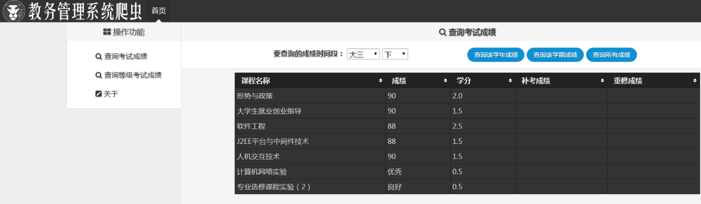

图2 本程序界面（界面更加紧凑精简，并具有排序功能）

2系统结构
=========

爬虫分为前端和后台两部分，前端负责发送请求，并根据AJAX技术返回的Json文档填充表格。后台负责根据前台传送来的数据代理登录正方教务系统，抓取数据后过滤为Json文档发送给前端。

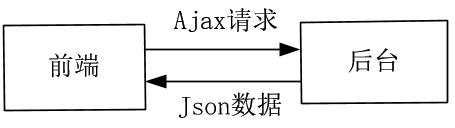

图3 系统结构图

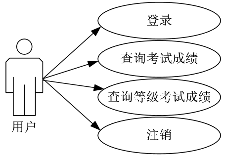

图4 系统用例图

3关键程序说明
=============

###### [./media/image5.png](./media/image5.png)

登录问题

图5 登录教务系统的http状态图

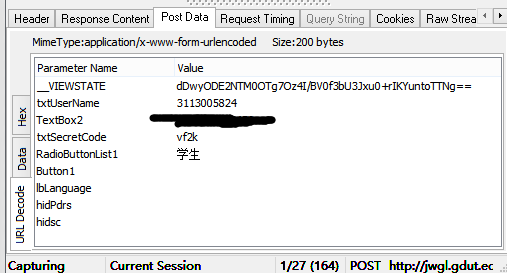

图6 登录时需要提交的http封包中PostData详情图

不同于其他的网站，教务管理系统采取了极为复杂的反爬虫机制，除了页面上会经常更新的ViewState码外，还采取了302跳转的方式，这使得爬虫编写的难度大大增加。

**采取方法：**

1.  每次登录抓取ViewState码

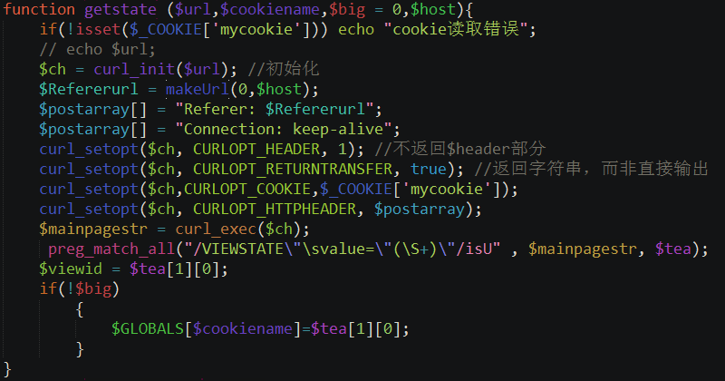

图7 抓取页面ViewState码

1.  使用跳转函数解决302跳转问题

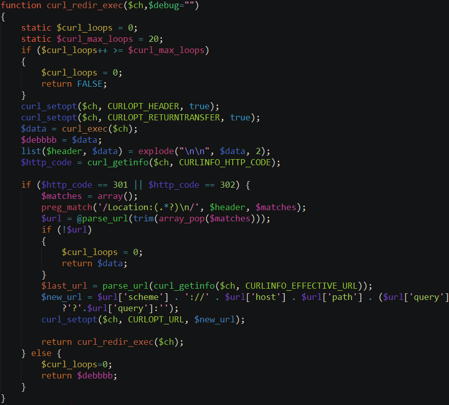

图8 重定向函数

###### 验证码

现存的正方教务系统爬虫都是通过使用default5，default6页面来绕过验证码的问题，而广工的教务系统已经封掉了这两个页面，必须解决验证码的问题才能进行登录

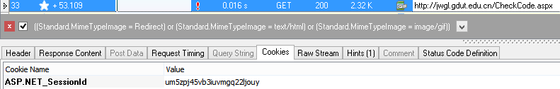

图9 验证码获取http请求

这里有三个问题，一是必须携带和获取ViewState的时候相同的Cookie，二是在提交登录请求的时候，也必须带上这个
Cookie
以及对应的验证码。三是要保证显示的图片是当时的验证码，而不是浏览器的缓存。

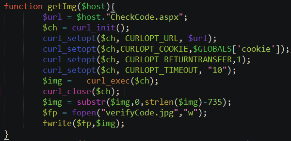

图10 获取验证码图片

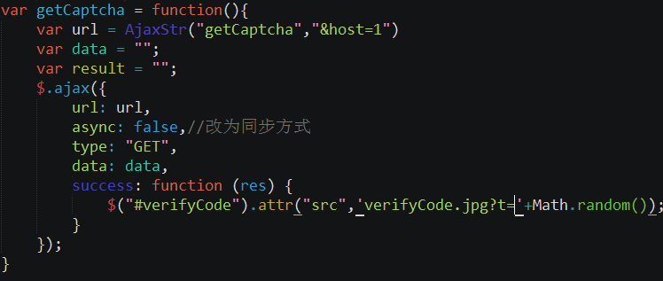

图11 用户端收到获取成功后利用添加随机数的方法避免显示的验证码是缓存

###### Json传输

用户端以 ajax 方式发起请求，服务器过滤数据后，整理成 Json
文件发回给客户端，用户端按指定格式展示。

图12 客户端发起ajax请求

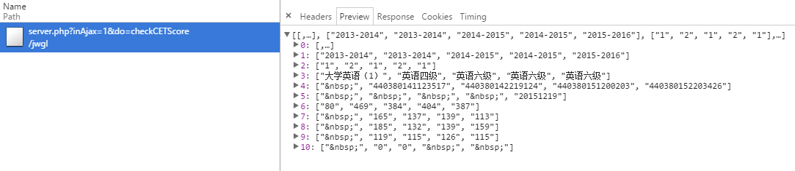

图13 服务器发回 Json 文件

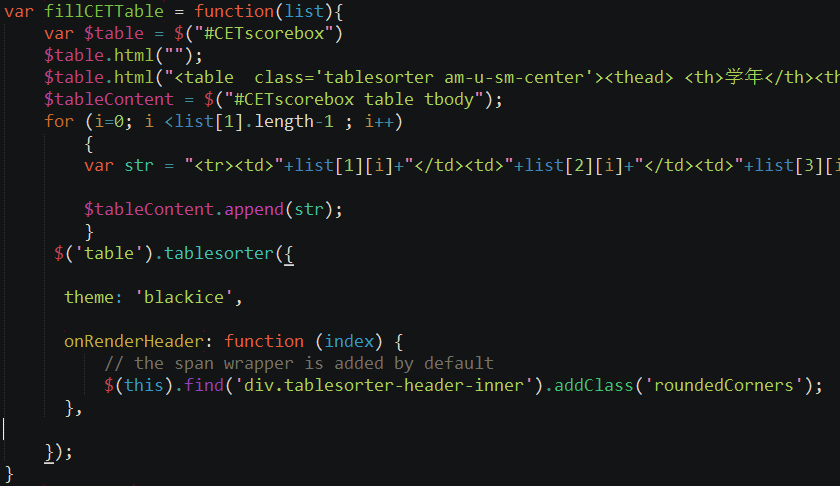

图14 用户端按指定格式显示 Json 数据

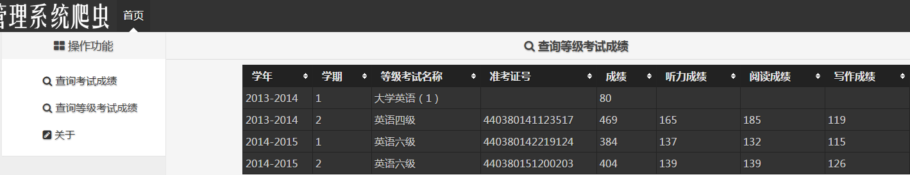

图15 Json 数据最终显示样式

4实现界面和功能以及屏幕截图
===========================

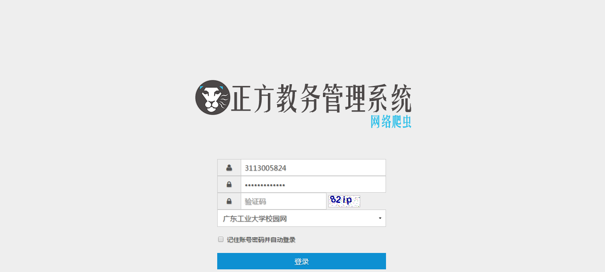

图16 程序登录界面

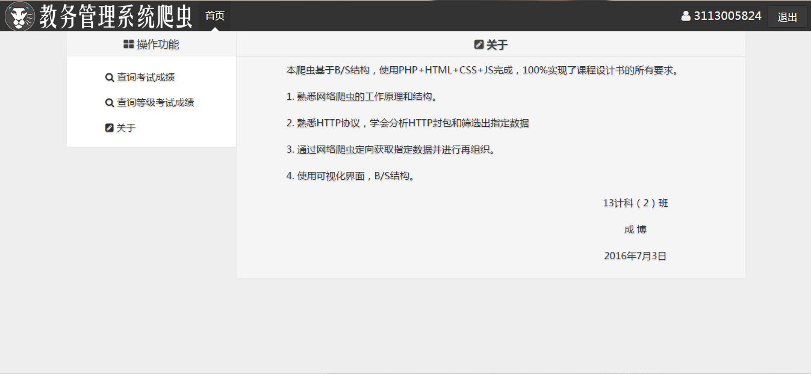

图17 关于界面

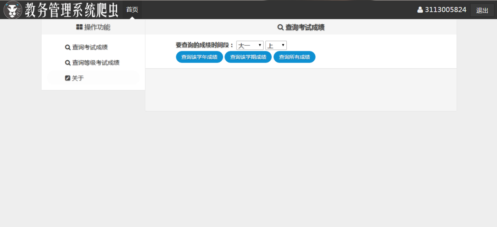

图18 成绩查询界面

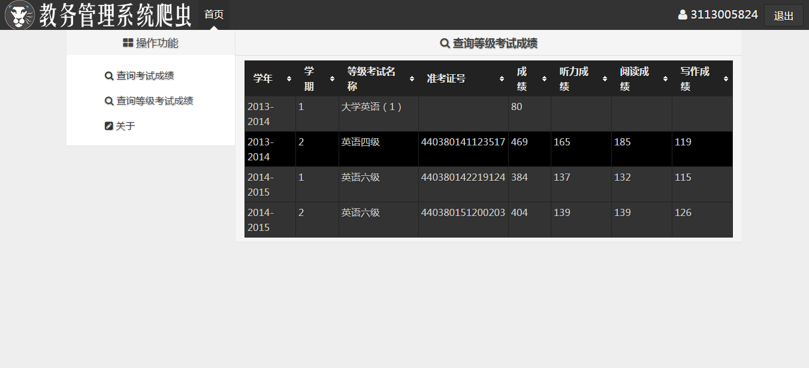

图19 等级考试成绩查询界面

5 调试过程中遇到的问题和解决的方法
==================================

**遇到的问题**

除了在关键程序说明中涉及的三个问题外还遇到了一个很麻烦的问题——编码问题，由于网页普遍存在编码问题导致的乱码，尤其是在本程序中还抓取了其他网站的编码，前端，后台，抓取网站这三者任意一个编码不同就会导致页面完全乱码。

**解决的办法**

在各个地方使用转码功能，将抓取的内容统一转换为UTF-8，同时在网页，PHP头，APACHE设置中将编码声明为UTF-8，终于解决了这个乱码问题。

>   \$inner = iconv("GBK", "UTF-8//IGNORE", \$inner);（转码语句）

6 测试与分析
============

1.  用户输入学号、密码、验证码登录

图20 用户输入学号、密码、验证码登录

1.  用户进入主界面

图21 用户进入主界面

1.  查看所有成绩

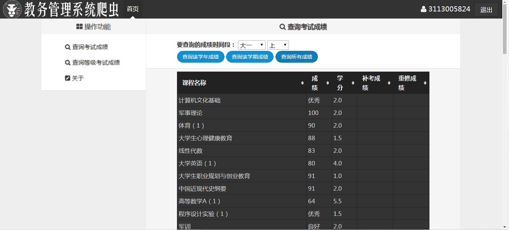

图22 查看所有成绩

1.  查看大三下成绩

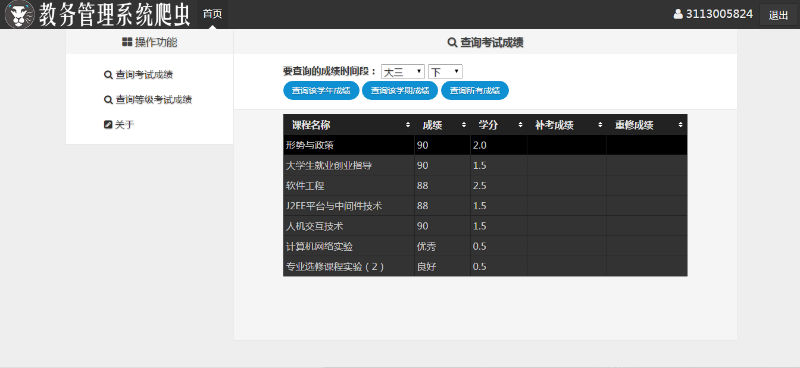

图23 查看大三下成绩

1.  对大三下成绩排序

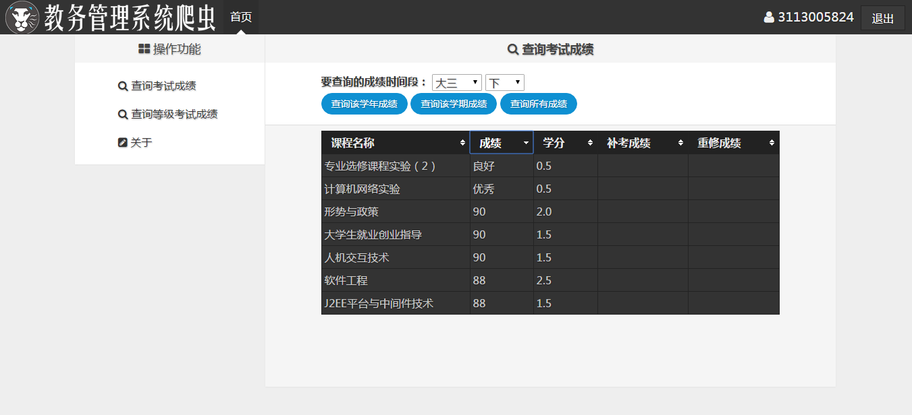

图24 对大三下成绩排序

1.  查看等级考试成绩

图25 查看等级考试成绩

1.  注销账号

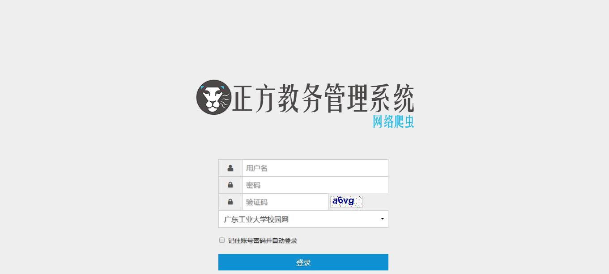

图26 注销账号

7 用户使用说明
==============

1.  用户在主界面输入账号、密码、验证码，点击登录即可进入主界面，如果框变红，则说明三者有一出错，检查输入后即可登录，点击图片或者刷新页面即可刷新验证。

2.  用户在主界面查询成绩，一段时间后（约20分钟）未操作，会导致教务系统将登陆身份注销，从而不能获得成绩，此时点击退出再重新登陆即可使用。

附录 
=====

带注释的源程序。如果提交源程序软盘，可以只列出程序文件名清单。

**/…**

**/css**

Style.css 界面样式管理文件

theme.black-ice.css 表格插件的样式文件

**/js**

Js.js 用户端核心操作文件，数据操作等大部分功能在这里实现

**/i**

favicon.ico 网页的标签栏图标

login.png

login_w.png 登录界面和主界面的LOGO

**/lib**

…(文件依赖，主要是AmazeUI的框架还有JQ文件)

Index.html 登录界面，从这里进入

main.html 主界面

function.php 函数文件，所有的PHP操作函数都在这里

server.php 过滤器文件，将请求过滤并调用function.php中的函数
